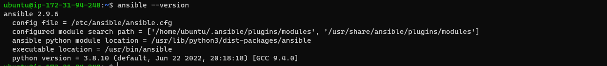
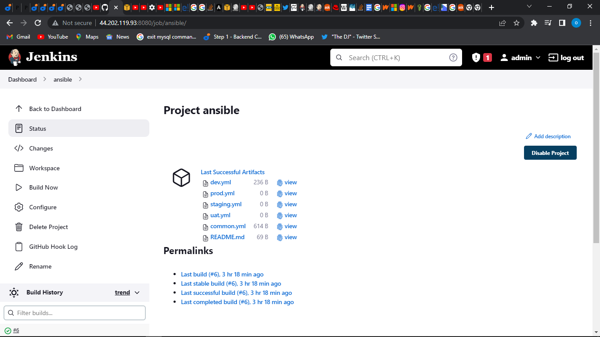
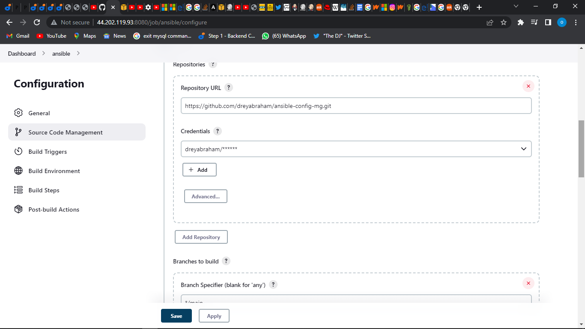
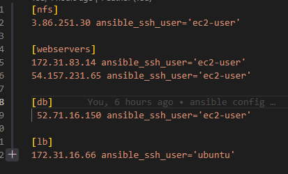
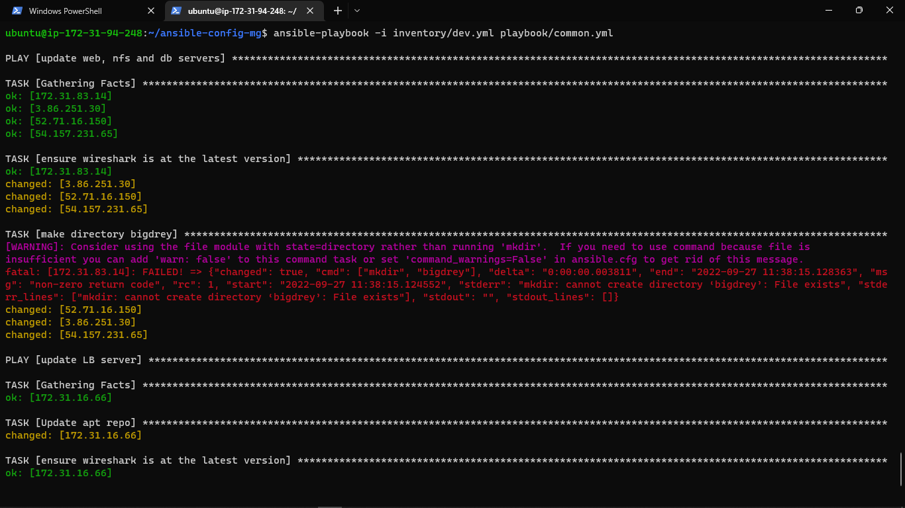
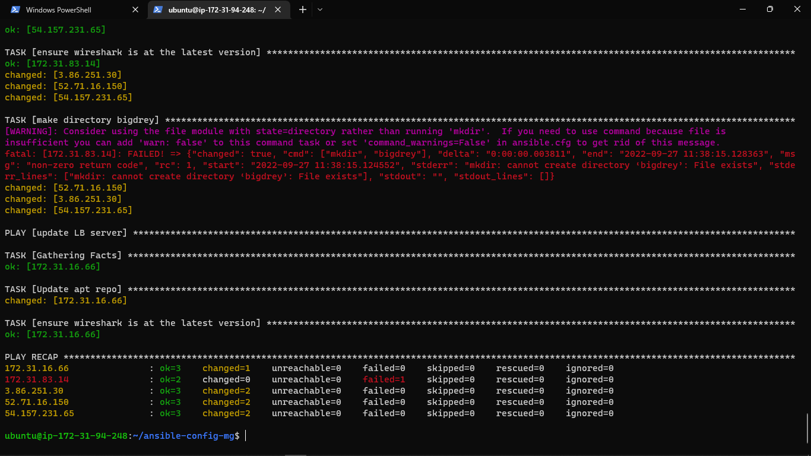
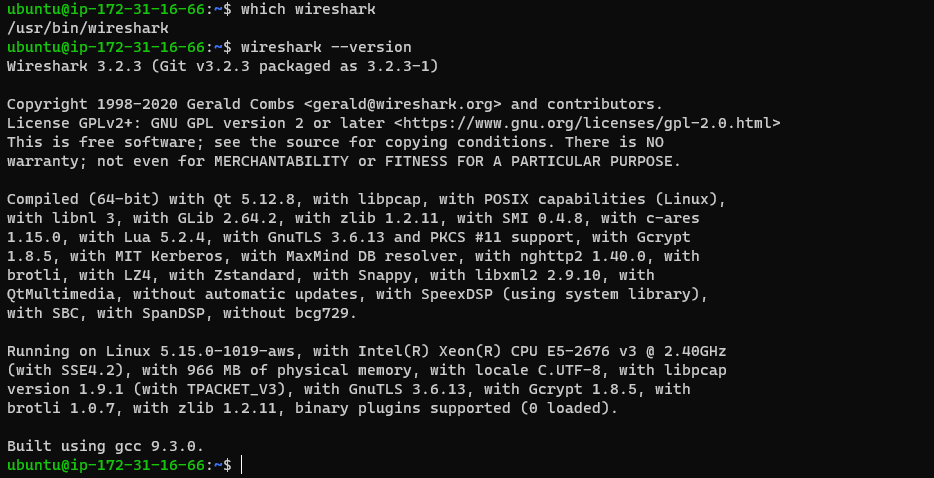
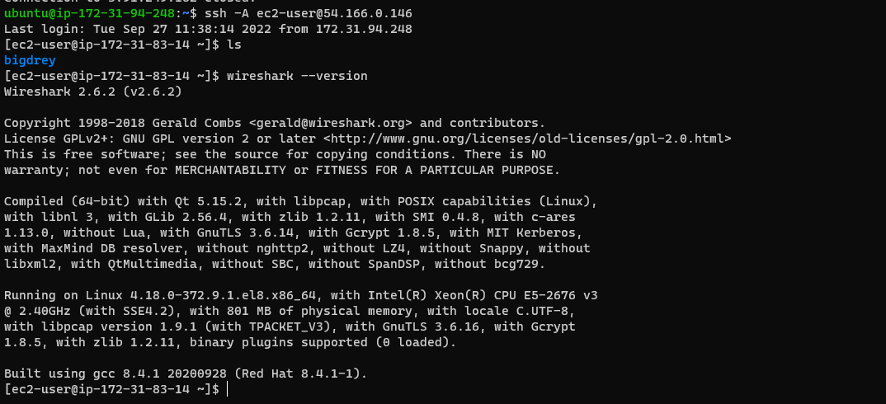

# DOCUMENTATION OF PROJECT 11

This project is about ansible configuration management. And we would be automating all we have done from project 7 - 10.

We would be making use of the tools Jenkins and Ansible.

First update your instance name to jenkins-Ansible 

then we install ansible on the terminal using the `sudo apt install ansible`



Now we are going to create a freestyle project called ansible on jenkins and configure it to save repository content with every change.





The above image shows that has been completed.

## ANSIBLE DEVELOPMENT

Now we begin Ansible development. Created a github repository to for our ansible configuration. Now we create a new branch for that will be used for development of ne features.

Now checkout the branch to the editor for building and development of our codes

Create a directory and name it playbooks,it will be used to store all your playbook files.
Create a directory and name it inventory,it will be used to keep hosts organised.
Within the playbooks folder, create your first playbook, and name it common.yml
Within the inventory folder, create an inventory file (.yml) for each environment (Development, Staging Testing and Production)


Now we set up our ansible inventory file



Input the above code in your development file.

Now setup your ssh-agent if its not done before. After this is done we move to the next part,creating a common playbook'

this is the file in which instructions are given to the servers.

```
---
- name: update web, nfs and db servers
  hosts: webservers, nfs, db
  remote_user: ec2-user
  become: yes
  become_user: root
  tasks:
    - name: ensure wireshark is at the latest version
      yum:
        name: wireshark
        state: latest

- name: update LB server
  hosts: lb
  remote_user: ubuntu
  become: yes
  become_user: root
  tasks:
    - name: Update apt repo
      apt: 
        update_cache: yes

    - name: ensure wireshark is at the latest version
      apt:
        name: wireshark
        state: latest

```

Input the above codes and instruction into the common.yml file

make changes and tweak as you like.

when this done lets push our recent changes to git.

using the commands `git add, git commit and git push`

Now we have to create a pull request and check the quality of the code  before merging it with the main branch.

Once the code has been merged our jenkins configuration will run a build automatically.

Now back to our jenkins-Ansible terminal. Pull the latest changes down into the terminal.

Now, it is time to execute ansible-playbook command and verify if the playbook actually works.

change directory into the cloned repository and run the command below `ansible-playbook -i inventory/dev.yml playbooks/common.yml`

 



Above image shows that the configuration is succesful.

Now we can go into the different terminals and check if our commannds worked





The above images show that we have succesfully automated project 7-10 using ansible and jenkins .


# END OF PROJECT 11
